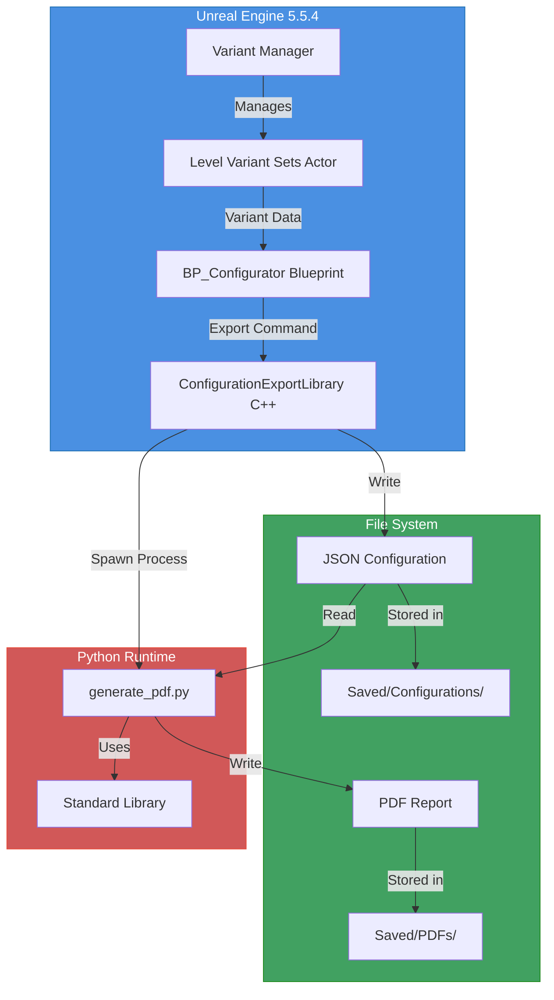
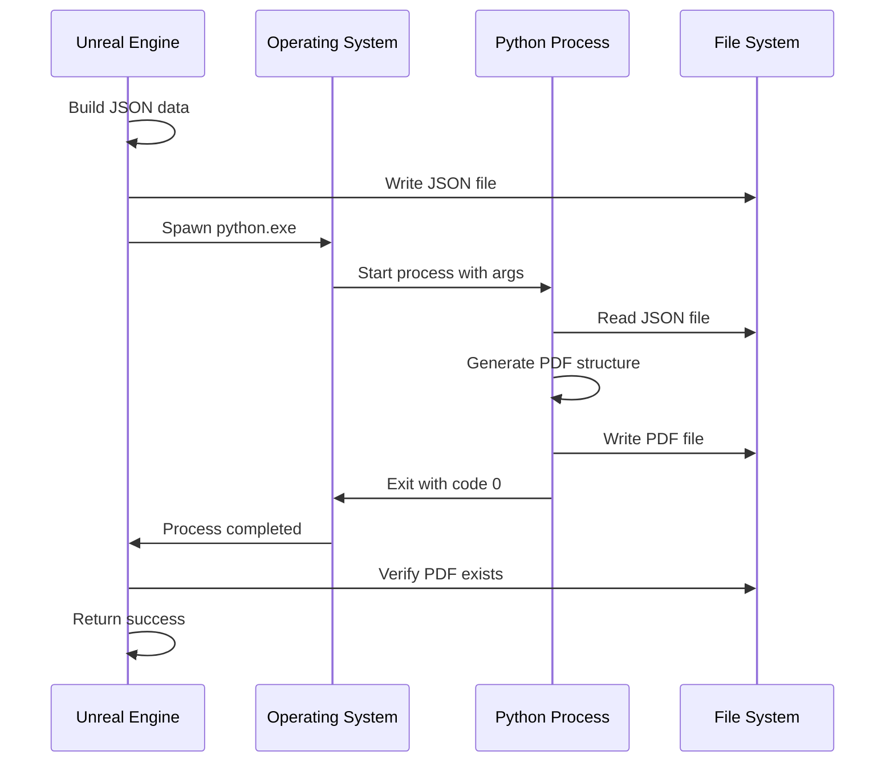

# Product Configurator - Complete Technical Documentation

 > **Welcome!** This guide provides comprehensive documentation for complete beginners AND advanced users. Every technical detail is explained with verification steps.

 ---

## 🔧 System Requirements & Prerequisites

### Critical Dependencies Overview

This project has **three core dependencies** that must be configured correctly:

| Component | Version Required | Purpose | Critical? |
|-----------|-----------------|---------|----------|
| **Unreal Engine** | 5.5.4 | Main application runtime | ✅ Yes |
| **Python** | 3.8+ | PDF generation system | ✅ Yes |
| **Visual Studio** | 2022 | C++ code compilation | ⚠️ For modifications only |

---

## 🐍 Python Environment Setup (CRITICAL)

### Why Python Is Required

This project generates **PDF reports** from JSON configuration data using a **custom Python script** that:
- Reads variant selection data exported from Unreal Engine
- Constructs PDF documents using raw PDF specification format (PDF 1.4)
- Saves reports to disk for customer/production use

**Without Python configured correctly, PDF exports will fail silently.**

### Architecture: How Python Integrates With Unreal


---

### Step 1: Install Python

#### Download & Installation

1. **Download Python 3.8 or newer**
   - Official site: https://www.python.org/downloads/
   - For Windows: Download "Windows installer (64-bit)"
   - Recommended: Python 3.11.x (current stable)

2. **CRITICAL: During Installation**
   - ✅ **CHECK** the box: "Add Python to PATH"
   - ✅ **CHECK** the box: "Add Python to environment variables"
   - ⚠️ This is THE MOST IMPORTANT STEP
   - This allows Unreal Engine's subprocess system to find and execute Python

3. **Choose installation location**
   - Default: `C:\Users\<YourName>\AppData\Local\Programs\Python\Python3xx\`
   - Or custom: `C:\Python3xx\` (easier to remember)

4. **Complete installation** (takes 2-3 minutes)

5. **Why PATH matters:**
   - When Unreal calls Python, it doesn't know where Python is installed
   - PATH tells Windows: "Python.exe is located at X"
   - Without PATH, you'll get: `FileNotFoundError: python.exe not found`

---

### Step 2: Verify Python Installation

#### Command Prompt Verification

1. **Open Command Prompt:**
   - Press `Windows Key + R`
   - Type: `cmd`
   - Press Enter
   - You'll see a black window with white text

2. **Test 1: Check Python Version**
   ```bash
   python --version
   ```
   
   **Expected output:**
   ```
   Python 3.11.8
   ```
   (Your version number may differ - any 3.8+ is acceptable)

3. **Test 2: Alternative Python Command**
   
   Some Windows installations use `py` launcher:
   ```bash
   py --version
   ```

4. **Test 3: Verify Standard Library**
   ```bash
   python -c "import json, sys, os; print('Python standard library: OK')"
   ```
   
   **Expected output:**
   ```
   Python standard library: OK
   ```

5. **Test 4: Check Python Executable Location**
   ```bash
   where python
   ```
   
   **Expected output:**
   ```
   C:\Users\<YourName>\AppData\Local\Programs\Python\Python311\python.exe
   ```

#### Troubleshooting Python Installation

**Error:** `'python' is not recognized as an internal or external command`

**Cause:** Python is NOT in your system PATH

**Solution Option A - Reinstall (Recommended):**
1. Uninstall Python (Settings → Apps → Python → Uninstall)
2. Reinstall and CHECK "Add Python to PATH"
3. Restart computer
4. Test again

**Solution Option B - Manual PATH Configuration:**

1. Find your Python installation directory:
   - Common locations:
     - `C:\Users\<YourName>\AppData\Local\Programs\Python\Python3xx\`
     - `C:\Python3xx\`

2. Add Python to PATH:
   - **Windows 10/11:**
     - Right-click "This PC" → Properties
     - Click "Advanced system settings"
     - Click "Environment Variables"
     - Find "Path"
     - Click "Edit"
     - Click "New"
     - Add Python directory (e.g., `C:\Python311\`)
     - Add Scripts directory (e.g., `C:\Python311\Scripts\`)
     - Click OK on all dialogs

3. **Restart Command Prompt** (or restart computer)
4. Test with `python --version`

---

### Step 3: Verify PATH Configuration

#### What is PATH?

PATH is a **system environment variable** that tells Windows where to find executable programs.

Think of it like a phone's contact list:
- Without PATH: You have to dial the full number every time
- With PATH: You can just say "Call Python" and it knows where to find it

#### Check Current PATH

1. Open Command Prompt
2. Type:
   ```bash
   echo %PATH%
   ```

3. Look for entries containing:
   - `...\Python3xx\`
   - `...\Python3xx\Scripts\`

**Example output (partial):**
```
C:\Windows\system32;C:\Python311;C:\Python311\Scripts;...
```

#### Verify Python Paths Exist

```bash
dir "C:\Users\<YourName>\AppData\Local\Programs\Python\Python311\python.exe"
```

If file exists, you'll see file information. If not, wrong path.

---

### Python Dependencies (IMPORTANT: None Required!)

#### What This Project Does NOT Use

❌ **ReportLab** - Not used  
❌ **FPDF** - Not used  
❌ **PyPDF2** - Not used  
❌ **Pillow** - Not used  
❌ **Any external libraries** - Not used  

**No `pip install` commands are needed!**

#### What This Project DOES Use

✅ **Standard Python Libraries** (Built into Python):

```python
import json      # Parse configuration data from Unreal
import sys       # Command-line arguments (file paths)
import os        # File system operations (create directories)
import datetime  # Timestamps (only in Unreal Python scripts)
```

These are **always included** with any Python installation.

#### Why Custom PDF Generation?

**This project generates PDFs manually using raw PDF specification format (PDF 1.4).**

**Benefits:**
- ✅ No external dependencies
- ✅ Simpler deployment
- ✅ Faster execution (no library loading)
- ✅ Complete control over PDF structure
- ✅ Works on any machine with Python

**How it works:**

The script (`Scripts/generate_pdf.py`) writes PDF files by:
1. Constructing PDF objects (Catalog, Pages, Page, Content Stream)
2. Defining fonts (Helvetica, Helvetica-Bold)
3. Positioning text with PDF operators (`Tf`, `Td`, `Tj`)
4. Building cross-reference table
5. Writing to file as binary

**Example PDF structure generated:**
```
%PDF-1.4
1 0 obj
<< /Type /Catalog /Pages 2 0 R >>
endobj
2 0 obj
<< /Type /Pages /Kids [3 0 R] /Count 1 >>
endobj
...
```

This is **lower-level** than ReportLab but gives complete control.

---

## 📚 Table of Contents

### Part 0: Technical Architecture (NEW)
0. [System Architecture Overview](#system-architecture-overview)
1. [Project Structure Deep Dive](#project-structure-deep-dive)
2. [PDF Generation Technical Breakdown](#pdf-generation-technical-breakdown)
3. [Blueprint to Python Data Flow](#blueprint-to-python-data-flow)
4. [File Locations Reference](#file-locations-reference)

### Part 1: Getting Started (For Complete Beginners)
1. [What Is This Project?](#what-is-this-project)
2. [What You'll Need](#what-youll-need)
3. [Installing Unreal Engine](#installing-unreal-engine)
4. [Opening The Project](#opening-the-project)
5. [Understanding The Interface](#understanding-the-interface)
6. [Your First Export Test](#your-first-export-test)

### Part 2: Understanding The System
7. [How The Configurator Works](#how-the-configurator-works)
8. [What Are Variant Sets?](#what-are-variant-sets)
9. [What Does The Export Do?](#what-does-the-export-do)

### Part 3: Customizing For Your Product
10. [Swapping The Guitar Model For A Car (Or Any Product)](#swapping-the-guitar-model-for-a-car)
11. [Adding New Variant Sets](#adding-new-variant-sets)
12. [Removing Variant Sets](#removing-variant-sets)
13. [Editing Existing Variants](#editing-existing-variants)
14. [Organizing Your Project](#organizing-your-project)

### Part 4: Advanced Customization
15. [Changing Where PDFs Are Saved](#changing-where-pdfs-are-saved)
16. [Changing File Names](#changing-file-names)
17. [Customizing The PDF Layout](#customizing-the-pdf-layout)

### Part 5: Troubleshooting & Help
18. [Common Problems & Solutions](#common-problems--solutions)
19. [Where To Get Help](#where-to-get-help)

---

## Part 0: Technical Architecture (NEW)

---

### System Architecture Overview

This project integrates **three major systems**:



#### Component Responsibilities

**Unreal Engine Layer:**
- **Level Variant Sets Actor**: Stores variant configuration
- **Variant Manager**: UI for creating/editing variants
- **BP_Configurator**: Manages variant selection state
- **ConfigurationExportLibrary (C++)**: Exports data and calls Python

**File System Layer:**
- **JSON Files**: Intermediate data format
- **PDF Files**: Final output reports
- **Directory Structure**: Organized by timestamp

**Python Layer:**
- **generate_pdf.py**: PDF generation engine
- **Standard Library**: File I/O, JSON parsing

---

### Project Structure Deep Dive

#### Complete File Tree

```
F:/0personal/ProductConfigurator/
├── ProductConfigurator.uproject          # Unreal project file
├── README.md                              # This documentation
│
├── Source/                                # C++ source code
│   ├── ProductConfigurator/
│   │   ├── Public/
│   │   │   └── ConfigurationExportLibrary.h   # Export function declarations
│   │   ├── Private/
│   │   │   └── ConfigurationExportLibrary.cpp # Export implementation
│   │   ├── ProductConfigurator.Build.cs       # Build configuration
│   │   └── ProductConfigurator.h              # Module header
│   └── ProductConfigurator.Target.cs       # Build target
│
├── Content/                               # Unreal assets
│   ├── ProductAssets/
│   │   ├── Meshes/                        # 3D models
│   │   ├── Materials/                     # Material assets
│   │   ├── Textures/                      # Texture files
│   │   ├── Blueprints/
│   │   │   ├── BP_Configurator.uasset     # Main configurator logic
│   │   │   └── BP_ConfigController.uasset # Player controller
│   │   ├── Levels/
│   │   │   └── Main.umap                  # Main scene level
│   │   └── VariantSet.uasset              # Variant configuration
│   ├── ProductConfig/
│   │   └── Blueprints/
│   │       ├── BP_ConfigController.uasset
│   │       └── BP_ConfigGameMode.uasset
│   └── Python/                            # Unreal Python scripts
│       ├── export_handler.py              # Editor-only export
│       └── packaged_export.py             # Packaged game export
│
├── Scripts/                               # External Python scripts
│   └── generate_pdf.py                    # PDF generation engine
│
├── Saved/                                 # Generated files (gitignored)
│   ├── Configurations/                    # JSON exports
│   │   └── Configuration_2026-01-28_12-34-56.json
│   ├── PDFs/                              # PDF reports
│   │   └── Configuration_2026-01-28_12-34-56.pdf
│   ├── Logs/                              # Unreal logs
│   └── Config/                            # Editor preferences
│
├── Config/                                # Project configuration
│   ├── DefaultEngine.ini                  # Engine settings
│   ├── DefaultGame.ini                    # Game settings
│   └── DefaultEditor.ini                  # Editor settings
│
├── Binaries/                              # Compiled executables (generated)
│   └── Win64/
│       └── ProductConfigurator.exe
│
└── Intermediate/                          # Build artifacts (generated)
    └── Build/
```

#### Key File Descriptions

| File | Type | Purpose | Edited By |
|------|------|---------|----------|
| **ProductConfigurator.uproject** | JSON | Project definition | Epic Launcher |
| **ConfigurationExportLibrary.cpp** | C++ | Export logic, Python spawning | Developer (VS) |
| **BP_Configurator** | Blueprint | Variant management, UI | Designer (UE) |
| **VariantSet.uasset** | Asset | Variant definitions | Designer (Variant Manager) |
| **generate_pdf.py** | Python | PDF generation | Developer (Any editor) |
| **export_handler.py** | Python | Unreal Python bridge | Developer (Any editor) |
| **Main.umap** | Level | Scene layout | Designer (UE) |

---

### PDF Generation Technical Breakdown

#### System Flow Detail

**Step-by-step execution:**

1. **User Action** (Unreal Editor)
   - User clicks export button in UI
   - Or runs Python console command
   - Or blueprint calls export function

2. **Blueprint Layer** (BP_Configurator)
   - Calls `Export Variant Sets to PDF` node
   - Passes `LevelVariantSetsActor` reference
   - Provides configuration name string

3. **C++ Layer** (ConfigurationExportLibrary.cpp)
   ```cpp
   // Pseudo-code
   ExportVariantSetsToPDF(LevelVariantSetsActor, ConfigName)
   {
       // 1. Extract variant data from actor
       VariantData = ReadActiveVariants(Actor);
       
       // 2. Build JSON structure
       JSON = {
           "configurationName": ConfigName,
           "timestamp": GetCurrentTime(),
           "selectedVariants": VariantData,
           "selectedEnvironment": EnvData,
           "selectedCamera": CameraData
       };
       
       // 3. Write JSON to disk
       JSONPath = "Saved/Configurations/" + ConfigName + "_" + Timestamp + ".json";
       WriteFile(JSONPath, JSON);
       
       // 4. Build PDF path
       PDFPath = "Saved/PDFs/" + ConfigName + "_" + Timestamp + ".pdf";
       
       // 5. Spawn Python process
       PythonExe = FindPythonExecutable();  // Searches PATH
       ScriptPath = "Scripts/generate_pdf.py";
       Arguments = [JSONPath, PDFPath];
       
       SpawnProcess(PythonExe, ScriptPath, Arguments);
       
       // 6. Wait for completion
       WaitForProcess();
       
       // 7. Verify PDF exists
       if (FileExists(PDFPath))
           return Success;
       else
           return Error;
   }
   ```

4. **Python Layer** (generate_pdf.py)
   ```python
   # Invoked as: python generate_pdf.py <json_path> <pdf_path>
   
   def generate_pdf(json_path, pdf_path):
       # 1. Load JSON
       with open(json_path, 'r') as f:
           config = json.load(f)
       
       # 2. Extract data
       config_name = config.get('configurationName', 'N/A')
       timestamp = config.get('timestamp', 'N/A')
       variants = config.get('selectedVariants', [])
       environment = config.get('selectedEnvironment', 'N/A')
       camera = config.get('selectedCamera', 'N/A')
       
       # 3. Build PDF text content
       lines = []
       lines.append('BT')  # Begin Text
       lines.append('/F2 16 Tf')  # Font: Helvetica-Bold, 16pt
       lines.append('50 750 Td')  # Position: x=50, y=750
       lines.append('(Product Configuration Summary) Tj')
       # ... more text operations
       lines.append('ET')  # End Text
       
       # 4. Calculate stream length
       stream = '\n'.join(lines)
       stream_len = len(stream.encode('latin-1'))
       
       # 5. Build PDF structure
       pdf = []
       pdf.append('%PDF-1.4')  # PDF version header
       pdf.append('1 0 obj')   # Object 1: Catalog
       pdf.append('<< /Type /Catalog /Pages 2 0 R >>')
       pdf.append('endobj')
       # ... more PDF objects
       
       # 6. Write to file
       os.makedirs(os.path.dirname(pdf_path), exist_ok=True)
       with open(pdf_path, 'wb') as f:
           f.write(('\n'.join(pdf)).encode('latin-1'))
       
       return True
   ```

5. **Result**
   - PDF file created at specified path
   - Unreal receives success/failure status
   - User sees notification or error message

#### JSON Schema

**File: `Saved/Configurations/<name>_<timestamp>.json`**

```json
{
  "configurationName": "Guitar_Configuration",
  "timestamp": "2026-01-28 12:34:56",
  "selectedVariants": [
    "Lighting: NeutralWarmCold",
    "Camera: Overview",
    "Body Shape: Strat Type",
    "Body Color: Black",
    "Hardware: Chrome",
    "Head Shape: Type A",
    "Pickups: Black",
    "Pick Guard: Black",
    "Fret Inlays: Pearl",
    "Fret Board: Light",
    "Tremolo: On"
  ],
  "selectedEnvironment": "NeutralWarmCold",
  "selectedCamera": "Overview"
}
```

**Schema Definition:**

```typescript
interface ConfigurationExport {
  configurationName: string;    // User-provided name
  timestamp: string;            // Format: "YYYY-MM-DD HH:MM:SS"
  selectedVariants: string[];   // Array of "SetName: VariantName"
  selectedEnvironment: string;  // Active environment variant
  selectedCamera: string;       // Active camera variant
}
```

#### PDF Structure

**PDF Objects:**

```
Object 1: Catalog       - Root of PDF document tree
Object 2: Pages         - Collection of pages
Object 3: Page          - Single page (8.5"x11", 612x792 points)
Object 4: Content       - Text and graphics content stream
```

**Fonts Used:**
- `/F1`: Helvetica (regular)
- `/F2`: Helvetica-Bold

**Text Positioning:**
- Coordinate system: Origin at bottom-left
- Units: Points (1/72 inch)
- Y-axis: 0 (bottom) to 792 (top)
- X-axis: 0 (left) to 612 (right)

**Example positioning:**
```
50 750 Td  = Start at (50, 750) - near top-left
0 -25 Td   = Move down 25 points
0 -18 Td   = Move down 18 points
```

---

### Blueprint to Python Data Flow

#### Communication Methods

**Method 1: Subprocess (Current Implementation)**



**Advantages:**
- Clean separation of concerns
- Python script can be tested independently
- No Unreal Engine dependencies in Python code
- Easy to debug (run Python script manually)

**Method 2: Unreal Python (Alternative)**

Files: `Content/Python/export_handler.py`

```python
import unreal

def export_config_to_json_and_pdf():
    # Runs INSIDE Unreal Engine Python environment
    # Has access to unreal.* modules
    # Can directly query actors and properties
    pass
```

**Used for:**
- Editor-only operations
- Direct access to Unreal objects
- Prototyping and testing

**Not used for:**
- Packaged games (Python interpreter not included)
- Final PDF generation (uses subprocess instead)

---

### File Locations Reference

#### Critical Paths

| Type | Default Path | Configurable? | Where to Change |
|------|-------------|---------------|----------------|
| **JSON Exports** | `Saved/Configurations/` | ✅ Yes | `ConfigurationExportLibrary.cpp` line ~29 |
| **PDF Exports** | `Saved/PDFs/` | ✅ Yes | `ConfigurationExportLibrary.cpp` line ~91 |
| **Python Script** | `Scripts/generate_pdf.py` | ✅ Yes | `ConfigurationExportLibrary.cpp` line ~95 |
| **Python Executable** | System PATH | ✅ Yes | Environment variables |
| **Project Root** | `F:/0personal/ProductConfigurator/` | ❌ No | Determined by .uproject location |

#### Path Construction

**Relative Paths (Default):**
```cpp
FString ProjectDir = FPaths::ProjectDir();
// Returns: "F:/0personal/ProductConfigurator/"

FString SaveDir = ProjectDir + "Saved/Configurations/";
// Results in: "F:/0personal/ProductConfigurator/Saved/Configurations/"
```

**Absolute Paths (Custom):**
```cpp
FString SaveDir = TEXT("F:/MyExports/JSONFiles/");
// Fixed location, not relative to project
```

#### Environment Variables Used

**Automatically detected by Unreal:**
- `PATH` - Searches for python.exe
- `PYTHONPATH` - (Optional) Python module search paths
- `TEMP` / `TMP` - Temporary file storage

---

## Part 1: Getting Started (For Complete Beginners)

---

### What Is This Project?

This is a **Product Configurator** built in Unreal Engine. Think of it like a 3D customizer you might see on a car manufacturer's website, but it runs in real-time 3D.

**What it does:**
- Shows a 3D product (currently a guitar)
- Lets users customize different parts (color, shape, accessories)
- Exports a PDF report showing what was selected
- Can be adapted for ANY product (cars, furniture, clothing, etc.)

**Current Setup:**
- **Product:** Guitar
- **11 Customization Options:** Lighting, Camera, Body Shape, Body Color, Hardware, Head Shape, Pickups, Pick Guard, Fret Inlays, Fret Board, Tremolo

**Technical Implementation:**
- **Engine:** Unreal Engine 5.5.4
- **Variant System:** Level Variant Sets (built-in UE feature)
- **Export System:** C++ + Python pipeline
- **Output Format:** PDF 1.4 specification

---

### What You'll Need

#### Required Software (All Free*)

1. **Unreal Engine 5.5.4**
   - Download from: Epic Games Launcher
   - Size: ~40GB
   - *Free for learning/evaluation
   - Used for: Main application runtime

2. **Python 3.8+**
   - Download from: https://www.python.org/downloads/
   - Size: ~100MB
   - *Free and open source
   - Used for: PDF generation
   - **CRITICAL:** Check "Add Python to PATH" during installation

3. **Visual Studio 2022 Community Edition** (optional, for C++ editing)
   - Download from: https://visualstudio.microsoft.com/
   - Size: ~10GB
   - *Free for individuals
   - Used for: C++ code compilation
   - **Important:** Select "Game Development with C++" workload

#### Your Computer Should Have:
- **CPU:** Modern quad-core or better
- **RAM:** 16GB minimum (32GB recommended)
- **GPU:** NVIDIA GTX 1070 or AMD equivalent or better
- **Storage:** 100GB free space (SSD recommended)
- **OS:** Windows 10/11 (64-bit)


---

## Advanced Troubleshooting: Python Integration

### Problem: PDF Not Generated

#### Diagnostic Steps

**Step 1: Check Python is accessible**
```bash
python --version
```
If error: Python not in PATH (see installation steps above)

**Step 2: Test Python script manually**
```bash
cd F:\0personal\ProductConfigurator
python Scripts\generate_pdf.py Saved\Configurations\test.json Saved\PDFs\test.pdf
```

Create test JSON first:
```json
{
  "configurationName": "Test",
  "timestamp": "2026-01-28 12:00:00",
  "selectedVariants": ["Test: Variant"],
  "selectedEnvironment": "Test",
  "selectedCamera": "Test"
}
```

**Step 3: Check Unreal Engine logs**
```
F:\0personal\ProductConfigurator\Saved\Logs\ProductConfigurator.log
```

Search for:
- `ConfigurationExportLibrary` - Export function calls
- `Python` - Python process spawning
- `Error` - Any error messages

**Step 4: Verify file permissions**
- Ensure `Saved/` directory is writable
- Check antivirus isn't blocking file creation
- Run Unreal Editor as Administrator (if needed)

### Problem: Python Process Spawning Fails

**Symptoms:**
- Export returns error immediately
- Log shows: "Could not spawn Python process"

**Causes & Solutions:**

**Cause 1:** Python not in PATH
- **Test:** Open CMD, type `python --version`
- **Fix:** Add Python to PATH (see installation steps)

**Cause 2:** Python executable name mismatch
- Some systems use `python3` instead of `python`
- **Fix:** Edit `ConfigurationExportLibrary.cpp`:
  ```cpp
  // Change from:
  FString PythonExe = TEXT("python");
  // To:
  FString PythonExe = TEXT("python3");
  // Or use absolute path:
  FString PythonExe = TEXT("C:/Python311/python.exe");
  ```

**Cause 3:** Antivirus blocking subprocess
- **Fix:** Add Unreal Editor to antivirus exclusions

### Problem: PDF Generated But Corrupted

**Symptoms:**
- PDF file exists but won't open
- "File is damaged" error

**Causes & Solutions:**

**Cause 1:** Text encoding issues
- Non-ASCII characters in variant names
- **Fix:** Use only ASCII characters in variant names
- Or modify `generate_pdf.py` to handle UTF-8:
  ```python
  def escape(s):
      s = str(s).encode('latin-1', errors='replace').decode('latin-1')
      return s.replace('\\', '\\\\').replace('(', '\\(').replace(')', '\\)')
  ```

**Cause 2:** Python script crashed mid-write
- Check Python script for errors
- **Test:** Run script manually with test data

### Problem: Export Works in Editor But Not in Packaged Game

**Explanation:**
Packaged games don't include Python interpreter by default.

**Solution:**
Need to package Python with the game:

1. **Option A:** Include Python in game package
   - Copy Python installation to game directory
   - Update paths to use bundled Python

2. **Option B:** Require Python installation
   - Document Python as system requirement
   - Installer checks for Python availability

3. **Option C:** Pre-generate PDFs (recommended)
   - Generate PDFs during packaging process
   - Include pre-made PDFs with game

---

## Technical Deep Dives

### Deep Dive: PDF Generation Algorithm

#### PDF 1.4 Specification Primer

**PDF Structure (Simplified):**
```
%PDF-1.4                  # Header
<Objects>                 # Numbered objects (1 0 obj, 2 0 obj, ...)
<Cross-Reference Table>   # xref - byte offsets of objects
<Trailer>                 # Document info and root object
%%EOF                     # End marker
```

**Our Implementation:**

```python
def generate_pdf(json_path, pdf_path):
    # 1. DATA LOADING
    with open(json_path, 'r', encoding='utf-8') as f:
        config = json.load(f)
    
    # 2. TEXT CONTENT GENERATION
    # Build PDF content stream (PostScript-like language)
    lines = []
    lines.append('BT')  # Begin Text Block
    
    # Set font: /F2 = Helvetica-Bold, 16pt size
    lines.append('/F2 16 Tf')
    
    # Set position: x=50 points, y=750 points (from bottom-left)
    lines.append('50 750 Td')
    
    # Draw text: Tj operator
    lines.append('(Product Configuration Summary) Tj')
    
    # Move text position: relative move 0 points right, 25 points down
    lines.append('0 -25 Td /F1 11 Tf')  # Also switch to smaller regular font
    
    # More text operations...
    for variant in variants:
        lines.append(f'({escape(variant)}) Tj 0 -14 Td')
    
    lines.append('ET')  # End Text Block
    
    # 3. STREAM LENGTH CALCULATION
    stream = '\n'.join(lines)
    stream_bytes = stream.encode('latin-1')
    stream_len = len(stream_bytes)
    
    # 4. PDF OBJECT CONSTRUCTION
    pdf = []
    
    # Object 1: Catalog (root of document tree)
    pdf.append('%PDF-1.4')
    pdf.append('1 0 obj')
    pdf.append('<< /Type /Catalog /Pages 2 0 R >>')
    pdf.append('endobj')
    
    # Object 2: Pages collection
    pdf.append('2 0 obj')
    pdf.append('<< /Type /Pages /Kids [3 0 R] /Count 1 >>')
    pdf.append('endobj')
    
    # Object 3: Single page
    pdf.append('3 0 obj')
    pdf.append('<<')
    pdf.append('/Type /Page')
    pdf.append('/Parent 2 0 R')
    pdf.append('/MediaBox [0 0 612 792]')  # 8.5"x11" in points
    pdf.append('/Contents 4 0 R')  # References content stream
    pdf.append('/Resources <<')
    pdf.append('/Font <<')
    pdf.append('/F1 << /Type /Font /Subtype /Type1 /BaseFont /Helvetica >>')
    pdf.append('/F2 << /Type /Font /Subtype /Type1 /BaseFont /Helvetica-Bold >>')
    pdf.append('>>')
    pdf.append('>>')
    pdf.append('>>')
    pdf.append('endobj')
    
    # Object 4: Content stream
    pdf.append('4 0 obj')
    pdf.append(f'<< /Length {stream_len} >>')
    pdf.append('stream')
    pdf.append(stream)
    pdf.append('endstream')
    pdf.append('endobj')
    
    # 5. CROSS-REFERENCE TABLE
    # (Simplified - fixed offsets for demo)
    pdf.append('xref')
    pdf.append('0 5')  # 5 objects (0-4)
    pdf.append('0000000000 65535 f')
    pdf.append('0000000009 00000 n')
    pdf.append('0000000058 00000 n')
    pdf.append('0000000115 00000 n')
    pdf.append('0000000344 00000 n')
    
    # 6. TRAILER
    pdf.append('trailer')
    pdf.append('<< /Size 5 /Root 1 0 R >>')
    pdf.append('startxref')
    pdf.append(str(400 + stream_len))  # Byte offset to xref table
    pdf.append('%%EOF')
    
    # 7. FILE WRITING
    os.makedirs(os.path.dirname(pdf_path), exist_ok=True)
    with open(pdf_path, 'wb') as f:
        pdf_content = '\n'.join(pdf)
        f.write(pdf_content.encode('latin-1'))
    
    return True
```

**Why This Works:**
- PDF readers parse the structure top-to-bottom
- Cross-reference table allows random access to objects
- Content stream is interpreted as drawing commands
- Fonts are built into PDF standard (no external files needed)

### Deep Dive: C++ Export Function

**File:** `Source/ProductConfigurator/Private/ConfigurationExportLibrary.cpp`

**Function Signature:**
```cpp
FExportResult UConfigurationExportLibrary::ExportVariantSetsToPDF(
    ALevelVariantSetsActor* VariantSetsActor,
    FString ConfigurationName
)
```

**Implementation Overview:**

```cpp
// 1. VALIDATE INPUTS
if (!VariantSetsActor) {
    return FExportResult{
        false,
        TEXT(""),
        TEXT("Invalid VariantSetsActor reference")
    };
}

// 2. EXTRACT VARIANT DATA
ULevelVariantSets* VariantSets = VariantSetsActor->GetLevelVariantSets();
if (!VariantSets) {
    return FExportResult{false, TEXT(""), TEXT("No VariantSets found")};
}

// Iterate through all variant sets
TArray<FString> SelectedVariants;
for (UVariantSet* VarSet : VariantSets->GetVariantSets()) {
    UVariant* ActiveVariant = VarSet->GetActiveVariant();
    if (ActiveVariant) {
        FString VariantName = VarSet->GetDisplayText().ToString() + 
                              ": " + 
                              ActiveVariant->GetDisplayText().ToString();
        SelectedVariants.Add(VariantName);
    }
}

// 3. BUILD JSON STRUCTURE
TSharedPtr<FJsonObject> JsonObject = MakeShared<FJsonObject>();
JsonObject->SetStringField(TEXT("configurationName"), ConfigurationName);
JsonObject->SetStringField(TEXT("timestamp"), FDateTime::Now().ToString());

// Convert variant array to JSON array
TArray<TSharedPtr<FJsonValue>> VariantArray;
for (const FString& Variant : SelectedVariants) {
    VariantArray.Add(MakeShared<FJsonValueString>(Variant));
}
JsonObject->SetArrayField(TEXT("selectedVariants"), VariantArray);

// 4. GENERATE FILE PATHS
FString Timestamp = FDateTime::Now().ToString(TEXT("%Y-%m-%d_%H-%M-%S"));
FString SafeConfigName = ConfigurationName.IsEmpty() ? TEXT("Configuration") : ConfigurationName;

FString JsonPath = FPaths::ProjectDir() / TEXT("Saved/Configurations") / 
                   FString::Printf(TEXT("%s_%s.json"), *SafeConfigName, *Timestamp);
FString PdfPath = FPaths::ProjectDir() / TEXT("Saved/PDFs") / 
                  FString::Printf(TEXT("%s_%s.pdf"), *SafeConfigName, *Timestamp);

// 5. WRITE JSON TO FILE
FString JsonString;
TSharedRef<TJsonWriter<>> JsonWriter = TJsonWriterFactory<>::Create(&JsonString);
FJsonSerializer::Serialize(JsonObject.ToSharedRef(), JsonWriter);

if (!FFileHelper::SaveStringToFile(JsonString, *JsonPath)) {
    return FExportResult{false, TEXT(""), TEXT("Failed to write JSON file")};
}

// 6. SPAWN PYTHON PROCESS
FString PythonExe = TEXT("python");  // Assumes python is in PATH
FString ScriptPath = FPaths::ProjectDir() / TEXT("Scripts/generate_pdf.py");
FString Arguments = FString::Printf(TEXT("\"%s\" \"%s\""), *JsonPath, *PdfPath);

void* ReadPipe = nullptr;
void* WritePipe = nullptr;
FPlatformProcess::CreatePipe(ReadPipe, WritePipe);

FProcHandle ProcessHandle = FPlatformProcess::CreateProc(
    *PythonExe,
    *Arguments,
    false,  // bLaunchDetached
    true,   // bLaunchHidden
    true,   // bLaunchReallyHidden
    nullptr,  // OutProcessId
    0,     // PriorityModifier
    nullptr,  // OptionalWorkingDirectory
    WritePipe,  // PipeWriteChild
    ReadPipe   // PipeReadChild
);

if (!ProcessHandle.IsValid()) {
    FPlatformProcess::ClosePipe(ReadPipe, WritePipe);
    return FExportResult{false, TEXT(""), TEXT("Failed to spawn Python process")};
}

// 7. WAIT FOR COMPLETION
FPlatformProcess::WaitForProc(ProcessHandle);
int32 ReturnCode = 0;
FPlatformProcess::GetProcReturnCode(ProcessHandle, &ReturnCode);
FPlatformProcess::CloseProc(ProcessHandle);
FPlatformProcess::ClosePipe(ReadPipe, WritePipe);

// 8. VERIFY PDF WAS CREATED
if (ReturnCode != 0) {
    return FExportResult{
        false, 
        TEXT(""), 
        FString::Printf(TEXT("Python script failed with code %d"), ReturnCode)
    };
}

if (!FPaths::FileExists(PdfPath)) {
    return FExportResult{
        false, 
        TEXT(""), 
        TEXT("PDF file was not created")
    };
}

// 9. SUCCESS
return FExportResult{
    true,
    PdfPath,
    TEXT("")
};
```

**Key C++ Concepts Used:**
- `TArray` - Dynamic array container
- `TSharedPtr` - Smart pointer (reference counted)
- `FString` - Unreal's string class
- `FJsonObject` - JSON manipulation
- `FPlatformProcess` - Cross-platform process management
- `FPaths` - Path manipulation utilities
- `FFileHelper` - File I/O utilities

---

## Appendix: Complete API Reference

### Blueprint Nodes

#### Export Variant Sets to PDF

**Category:** Configuration Export Library

**Inputs:**
- `Variant Sets Actor` (ALevelVariantSetsActor*) - Reference to variant sets actor in level
- `Configuration Name` (String) - Name for this configuration export

**Outputs:**
- `Success` (Boolean) - True if export succeeded
- `PDF Path` (String) - Full path to generated PDF
- `Error Message` (String) - Error description if failed

**Example Usage (Blueprint):**
```
[Get All Actors of Class] (LevelVariantSetsActor)
    ↓
[Get (index 0)]
    ↓
[Export Variant Sets to PDF]
    Configuration Name: "MyConfiguration"
    ↓
[Branch]
    True → [Print String] "Success!"
    False → [Print String] Error Message
```

### Python API

#### generate_pdf.py

**Function:** `generate_pdf(json_path, pdf_path)`

**Parameters:**
- `json_path` (str) - Full path to input JSON file
- `pdf_path` (str) - Full path for output PDF file

**Returns:**
- `bool` - True if successful, False if error

**Raises:**
- `FileNotFoundError` - JSON file doesn't exist
- `json.JSONDecodeError` - Invalid JSON format
- `OSError` - Cannot write PDF file

**Command-line usage:**
```bash
python generate_pdf.py <json_path> <pdf_path>
```

**Example:**
```bash
python Scripts/generate_pdf.py Saved/Configurations/test.json Saved/PDFs/test.pdf
```

### C++ API

#### UConfigurationExportLibrary

**Header:** `Source/ProductConfigurator/Public/ConfigurationExportLibrary.h`

**Class:** `UConfigurationExportLibrary : public UBlueprintFunctionLibrary`

**Function:**
```cpp
UFUNCTION(BlueprintCallable, Category = "Configuration Export")
static FExportResult ExportVariantSetsToPDF(
    ALevelVariantSetsActor* VariantSetsActor,
    FString ConfigurationName
);
```

**Struct FExportResult:**
```cpp
USTRUCT(BlueprintType)
struct FExportResult {
    GENERATED_BODY()
    
    UPROPERTY(BlueprintReadOnly)
    bool bSuccess;
    
    UPROPERTY(BlueprintReadOnly)
    FString PDFPath;
    
    UPROPERTY(BlueprintReadOnly)
    FString ErrorMessage;
};
```


---

**Last Updated:** January 28, 2026  
**For:** Complete Beginners AND Advanced Users  
**Unreal Engine Version:** 5.5.4  
**Python Version:** 3.8+  
